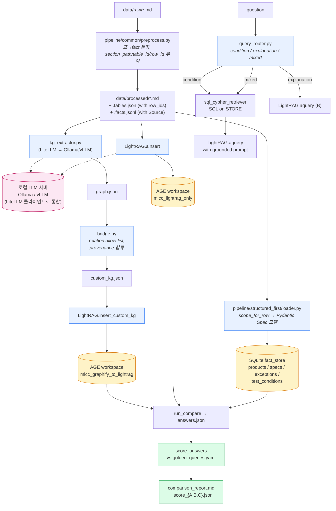

# MLCC Graph POC

MLCC 카탈로그 마크다운 문서를 대상으로 **세 가지 검색/응답 파이프라인**을
구축하고 동일 질의셋으로 비교한다. RAG 단독 비교가 아니라 "구조화 데이터
모델링이 RAG 품질에 어떤 영향을 주는가"를 본다.

- 파이프라인 A: `LiteLLM KG 추출기 → 후처리 → LightRAG(AGE)` — KG 보조 RAG (실험용)
- 파이프라인 B: `LightRAG(AGE)` 단독 — 베이스라인 RAG
- 파이프라인 C: `구조화 ETL → SQL/Cypher 우선 검색 → LightRAG 설명` — **권장 기준**

LLM 호출은 전부 **LiteLLM** 한 곳을 거쳐 로컬 **Ollama / vLLM** 으로 간다.
OpenCode/Aider/Codex 같은 host coding agent 는 더 이상 필요하지 않다.

핵심 명제는 `docs/data_contract.md` 에 정리되어 있고 평가는
`config/golden_queries.yaml` + `scripts/compare/score_answers.py` 로
자동 채점한다. 세부 목표, 비교 기준, 금지 사항은 `claude.md` 참고.

## 왜 세 가지인가

평가 피드백 (2026-04 review) 요약:

1. **LLM 기반 KG 추출은 모델 변경에 따라 결과가 달라진다**. 따라서 파이프라인
   A 는 "비교 실험용 보조 KG" 로 위치를 잡고, 추출기는 LiteLLM 으로 로컬
   Ollama/vLLM 에 직접 붙어 host coding agent 의존을 없앴다.
2. **수치 조건 검색을 LLM에 맡기는 건 가장 잘 틀리는 영역**이다. 전압,
   size, 온도특성, 예외 기종은 SQL/Cypher 조건식으로 먼저 필터링한다.
   파이프라인 C가 그 역할을 한다.
3. **"정답 가능한 구조화 DB"가 진짜 기준선**이다. 자연어 답변의 품질은
   그 위에서만 의미가 있다. 파이프라인 C는 SQLite 기반 fact store를
   먼저 구축하고, LightRAG는 설명형 질문/근거 문맥 보강에만 사용한다.

## 평가 자동화

- `config/queries.yaml` — 자연어 질의 (사람이 읽는 기준)
- `config/golden_queries.yaml` — `must_include` / `must_not_include` /
  `numeric_conditions` 가 있는 골든셋
- `scripts/compare/score_answers.py` — `must_include_hit`,
  `must_not_include_leak`, `num_violations`, `overall_pass` 자동 산출

---

## 아키텍처 플로우



핵심 포인트:
- **전처리는 공통** — 세 파이프라인의 입력이 bit-for-bit 동일해야 비교가 공정하다.
- **AGE 인스턴스는 하나**, workspace 로만 분리 — `docker compose up` 한 번으로 동시 실행.
- **C는 별도 ingest 가 가볍다** — SQLite 파일 하나(`output/fact_store.sqlite`)만 만들고, 설명형 질문은 B의 KG를 재사용한다.

---

## 디렉토리 구조

```
data/
  raw/                        # 원본 .md 입력
  processed/                  # 전처리 산출물 (세 파이프라인 공통 입력)
schema/
  spec_schema.py              # Product / Spec / Exception_ / TestCondition (Pydantic)
pipeline/
  common/
    preprocess.py             # md → tables.json + facts.jsonl + cleaned md
    normalize.py              # 단위/표기 정규화
    extract_product_scope.py  # 행 → product_id / family_id / 코드북 분류
    fact_store.py             # SQLite 캐노니컬 fact 저장소 (Pydantic 입력)
    query_router.py           # 자연어 → condition / explanation / mixed
    sql_cypher_retriever.py   # 결정적 검색 (SQL + AGE Cypher)
    age_client.py
    lightrag_bootstrap.py
  graphify_to_lightrag/       # 파이프라인 A: Graphify → bridge → LightRAG
  lightrag_only/              # 파이프라인 B: 전처리 md → LightRAG ainsert
  structured_first/           # 파이프라인 C: SQL/Cypher 우선 + LightRAG 설명
output/
  fact_store.sqlite           # 파이프라인 C의 source-of-truth
  graphify_to_lightrag/       # 파이프라인 A 산출물
  lightrag_only/              # 파이프라인 B 산출물
  structured_first/           # 파이프라인 C 산출물
  comparison/                 # comparison_report.md, score_{A,B,C}.json
scripts/
  preprocess/                 # 공통 전처리
  compare/
    run_compare.py            # 세 파이프라인 답변 수집
    score_answers.py          # golden_queries.yaml 자동 채점
  run_pipeline_a.py
  run_pipeline_b.py
  run_pipeline_c.py           # = fact_store load
docker/docker-compose.yml     # Apache AGE 컨테이너
sql/init_age.sql              # AGE 확장 로드 + 기본 graph
sql/init_pgvector.sql         # pgvector 가 있으면 활성화 (없으면 skip)
config/
  .env.sample
  queries.yaml                # 자연어 질의 (사람용)
  golden_queries.yaml         # 자동 채점용 골든셋
docs/
  data_contract.md            # ID/단위/aliases/provenance 규칙
```

---

## 사전 준비

### 1. Python 의존성

```bash
python -m venv .venv && source .venv/bin/activate
pip install -e .
```

### 2. 로컬 LLM 연결 (LiteLLM → Ollama / vLLM)

세 파이프라인 모두 LLM 호출은 **LiteLLM** 한 곳을 거친다. OpenCode/Aider/
Codex 같은 host coding agent 의존은 제거됐다. LiteLLM 모델 문자열만 맞춰
주면 Ollama/vLLM/LocalAI/LiteLLM 프록시 어디든 같은 코드로 붙는다.

| 백엔드 | `LLM_MODEL` 예시 | `LLM_BINDING_HOST` |
|---|---|---|
| Ollama | `ollama/llama3:70b` | `http://localhost:11434` |
| vLLM (OpenAI 호환) | `openai/Qwen2.5-32B-Instruct` | `http://localhost:8000/v1` |
| LiteLLM proxy | `openai/<alias>` | `http://localhost:4000` |

임베딩도 같은 규칙. Ollama 의 경우 `ollama/bge-m3`, vLLM/TEI 의 경우
`openai/bge-m3` + base_url. 모델의 실제 출력 차원을 `EMBEDDING_DIM` 에
정확히 맞춰야 한다 (LightRAG 제약 — 변경 시 vector 테이블 재생성 필요).

파이프라인 A 의 KG 추출도 같은 LLM 을 쓴다 (`pipeline/graphify_to_lightrag/
kg_extractor.py`). 호스트 agent 설치는 더 이상 필요 없다.

### 3. 환경 변수

```bash
cp config/.env.sample config/.env
# 또는 make env (자동으로 같은 일을 수행)
$EDITOR config/.env
```

`config/.env.sample` 에 모든 변수와 기본값이 있다. 핵심 그룹:

| 그룹 | 주요 변수 | 비고 |
|---|---|---|
| AGE / Postgres | `POSTGRES_*` | docker-compose 와 LightRAG 가 공유 |
| LightRAG 저장소 | `LIGHTRAG_*_STORAGE` | 기본값으로 AGE + NanoVectorDB |
| LLM (LiteLLM) | `LLM_MODEL`, `LLM_BINDING_HOST`, `LLM_BINDING_API_KEY`, `LLM_TIMEOUT` | Ollama / vLLM / LiteLLM 프록시 모두 동일 |
| 임베딩 (LiteLLM) | `EMBEDDING_MODEL`, `EMBEDDING_BINDING_HOST`, `EMBEDDING_DIM` | 모델 변경 시 vector 테이블 재생성 필요 |
| KG 추출 | `KG_BATCH_SIZE`, `KG_MAX_CONCURRENCY`, `GRAPHIFY_OUT_DIR` | 파이프라인 A 의 LLM 기반 추출기 튜닝 |
| Bridge | `MIN_EDGE_CONFIDENCE` | 저신뢰 엣지 drop threshold |

예시 — 로컬 vLLM (Qwen2.5-32B) + Ollama 임베딩 (bge-m3):

```bash
LLM_MODEL=openai/Qwen2.5-32B-Instruct
LLM_BINDING_HOST=http://localhost:8000/v1
LLM_BINDING_API_KEY=sk-local-placeholder

EMBEDDING_MODEL=ollama/bge-m3
EMBEDDING_BINDING_HOST=http://localhost:11434
EMBEDDING_DIM=1024
```

예시 — 모두 Ollama:

```bash
LLM_MODEL=ollama/llama3:70b
LLM_BINDING_HOST=http://localhost:11434
EMBEDDING_MODEL=ollama/bge-m3
EMBEDDING_BINDING_HOST=http://localhost:11434
EMBEDDING_DIM=1024
```

### 4. Apache AGE 기동

```bash
make age-up
# 내부적으로: docker compose --env-file config/.env -f docker/docker-compose.yml up -d
```

`sql/init_age.sql` 이 초기 실행되어 `mlcc_graphify_to_lightrag`,
`mlcc_lightrag_only` 두 개의 graph 가 생성된다.

컨테이너 상태 확인:

```bash
make age-logs           # 로그 tail
make age-psql           # psql 세션 (LOAD 'age' 수동 필요)
```

---

## 실행 순서

```bash
make preprocess         # data/raw → data/processed (tables.json + facts.jsonl)
make pipeline-c         # data/processed → output/fact_store.sqlite (canonical facts)
make pipeline-a         # Graphify → custom_kg → AGE workspace A (선택)
make pipeline-b         # 전처리 md → AGE workspace B
make compare            # 세 파이프라인 질의 실행 + comparison_report.md
make score              # golden_queries.yaml 기반 자동 채점
```

각 단계 산출물:

| 단계 | 산출물 |
|---|---|
| preprocess | `data/processed/*.md`, `*.tables.json` (with row_ids), `*.facts.txt`, `*.facts.jsonl` |
| pipeline A | `graphify_raw/graphify-out/graph.json`, `custom_kg.json`, `custom_kg.stats.json`, `rag_state/` |
| pipeline B | `output/lightrag_only/rag_state/` |
| pipeline C | `output/fact_store.sqlite` |
| compare   | `output/{graphify_to_lightrag,lightrag_only,structured_first}/answers.json`, `output/comparison/comparison_report.md` |
| score     | `output/comparison/score_{A,B,C}.json` |

`make compare` 의 파이프라인 부분 집합만 돌리려면:

```bash
python -m scripts.compare.run_compare --pipelines B,C
```

(예를 들어 KG 추출기에 시간을 쓰고 싶지 않을 때 A를 빼고 B,C 만 비교.)

---

## 문서 추가/수정 후 그래프에 반영하기

claude.md 의 비교 기준 5번("증분 처리 편의성")을 위한 절차. 두 파이프라인의
동작이 다르므로 각각 따로 정리한다.

### 케이스 1 — `data/raw/` 에 새 파일 추가

```bash
cp /path/to/new_spec.md data/raw/
make preprocess                       # 공통 전처리 (새 파일만 다시 처리)
make pipeline-a && make pipeline-b    # 양쪽 증분 ingest
make compare                          # 질의 재실행
```

### 케이스 2 — 기존 파일 내용 수정

```bash
# 파일 편집
$EDITOR data/raw/mlcc_catalog_rag_master_ko.md
make preprocess                       # 전처리 산출물 갱신
```

이후는 파이프라인별로 동작이 다르다.

**파이프라인 B (LightRAG 단독)**

`LightRAG.ainsert` 는 내용 해시로 중복을 판정하므로 **같은 문서의 변경분은
재삽입 시 기존 엔티티/관계를 LLM이 갱신해서 KG가 upsert** 된다. 별다른
플래그 없이 그대로 실행:

```bash
make pipeline-b
```

완전 삭제된 문서는 LightRAG 의 document deletion API 로 지운다
(`pipeline/lightrag_only/runner.py` 에 아직 래퍼 없음 — 필요 시 추가).
워크스페이스 전체를 초기화하려면 아래 "초기화" 절 참고.

**파이프라인 A (LiteLLM KG 추출기 → LightRAG)**

`pipeline/graphify_to_lightrag/kg_extractor.py` 가 매 실행마다 `*.facts.jsonl`
전체를 batch 로 LLM 에 보내 새 `graph.json` 을 만든다. 증분 캐시는 아직
없으므로 큰 코퍼스에서는 `KG_BATCH_SIZE` / `KG_MAX_CONCURRENCY` 를 모델
처리량에 맞게 올린다.

```bash
make pipeline-a
```

브리지는 매 실행마다 `graph.json` 전체를 다시 `custom_kg.json` 으로
변환하고 LightRAG 에 `insert_custom_kg` 를 재호출한다. LightRAG 는 같은
entity/relationship 이 다시 들어오면 description 을 병합한다.

### 케이스 3 — 파이프라인 비교를 **깨끗한 상태에서** 다시 하고 싶다

두 workspace 를 비운다. 가장 간단한 방법은 AGE 그래프를 drop / recreate:

```bash
make age-psql
```

psql 세션 내:

```sql
LOAD 'age';
SET search_path = ag_catalog, "$user", public;

SELECT drop_graph('mlcc_graphify_to_lightrag', true);
SELECT drop_graph('mlcc_lightrag_only', true);
SELECT create_graph('mlcc_graphify_to_lightrag');
SELECT create_graph('mlcc_lightrag_only');
```

LightRAG 의 KV/vector 테이블(`lightrag_*`)도 동시에 비워야 한다. 컨테이너
자체를 재생성하는 게 가장 깨끗하다:

```bash
make age-down
docker volume rm docker_age_data   # 컨테이너 이름 prefix 는 환경에 따라 다를 수 있음
make age-up
```

이후 `preprocess → pipeline-a → pipeline-b → compare` 다시.

### 케이스 4 — KG 추출기 출력만 비우고 재추출

LLM 프롬프트나 모델을 바꾼 뒤 KG 를 다시 만들고 싶다면 추출 결과만 지우고
다시 돌리면 된다 (LightRAG workspace 는 살아 있으면 alias 머지가 일어나므로
필요시 케이스 3 를 같이 수행).

```bash
rm -rf output/graphify_to_lightrag/graphify_raw/graphify-out
make pipeline-a
```

---

## AGE 그래프 직접 확인

```bash
make age-psql
```

```sql
LOAD 'age';
SET search_path = ag_catalog, "$user", public;

-- 워크스페이스별 노드/엣지 수
SELECT * FROM cypher('mlcc_graphify_to_lightrag',
    $$ MATCH (n) RETURN count(n) $$) AS (c agtype);

-- 특정 엔티티 이웃
SELECT * FROM cypher('mlcc_lightrag_only',
    $$ MATCH (n {entity_id:'X7R'})-[r]-(m) RETURN n, r, m LIMIT 20 $$)
    AS (n agtype, r agtype, m agtype);
```

파이썬에서는 `pipeline.common.age_client.AgeClient` 가 같은 역할을 한다.
비교 보고서의 그래프 크기 셀은 이 클라이언트로 채워진다.

---

## 구현 원칙 리마인더 (claude.md + 2026-04 review)

1. 세 파이프라인은 **동일 전처리**를 사용한다.
2. Markdown 표는 **코드로 파싱**해서 fact 문장으로만 LLM에 노출한다.
3. **수치/단위 비교는 LLM에 위임하지 않는다.** 전압 ≥ 4.5V 같은 조건은
   `pipeline/common/sql_cypher_retriever.py` 가 SQL로 수행한다.
4. **모든 fact 는 `Source` (source_doc, section_path, table_id, row_id) 를
   가진다.** 출처 없는 fact는 fact store에 들어가지 않는다.
5. KG 추출기는 **로컬 Ollama / vLLM 에 LiteLLM 으로 직접** 붙는다.
   OpenCode/Aider/Codex 같은 host coding agent 의존은 없다.
6. KG 추출 결과는 **반드시 bridge 로 후처리**되며, relation type allow-list 를
   통과하지 못한 엣지는 'OTHER' 로 표시된다.
7. **파이프라인 A 는 비교 실험용 보조 KG 다.** 정답 기준선은 파이프라인 C
   (구조화 fact store) 다.
8. 완벽한 최종 구조보다 **공정한 비교 실험과 자동 채점**을 우선한다.

## 알려진 제약 / 환경 주의사항

- 기본 docker 이미지(`apache/age:PG16_latest`)는 pgvector를 포함하지 않는다.
  `.env.sample` 의 `LIGHTRAG_VECTOR_STORAGE` 기본값은
  `NanoVectorDBStorage` (파일 기반). pgvector + AGE를 같이 쓰려면 별도
  이미지를 빌드한 뒤 `LIGHTRAG_VECTOR_STORAGE=PGVectorStorage` 로 바꾼다.
- 파이프라인 A 의 KG 는 LLM 출력에 의존하므로 모델 변경 시 결과가 변한다.
  비교 결과를 보고할 때는 항상 `output/graphify_to_lightrag/graphify_raw/
  graphify-out/extract_stats.json` (모델, batch 수, 노드/엣지 수) 도 함께
  남긴다.
