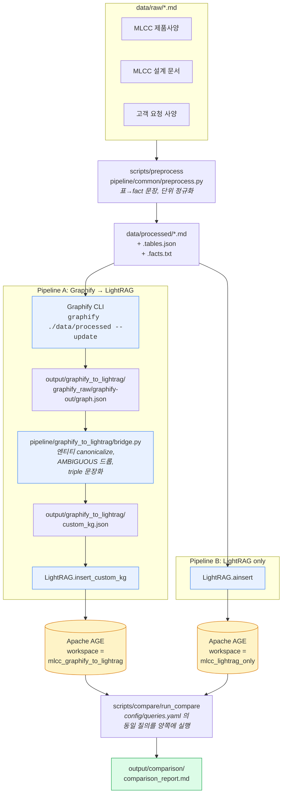

# MLCC Graph POC

MLCC 카탈로그 마크다운 문서를 대상으로 **두 가지 RAG 파이프라인**을 구축하고
동일 질의셋으로 비교한다. 두 파이프라인 모두 **Apache AGE**(PostgreSQL
확장)를 그래프 저장소로 공유하며, 각자 다른 workspace 에 격리된다.

- 파이프라인 A: `Graphify → 후처리 → LightRAG(AGE)`
- 파이프라인 B: `LightRAG(AGE)` 단독

세부 목표, 비교 기준, 금지 사항은 `claude.md` 참고.

---

## 아키텍처 플로우



핵심 포인트:
- **전처리는 공통** — 두 파이프라인의 입력이 bit-for-bit 동일해야 비교가 공정하다.
- **AGE 인스턴스는 하나**, workspace 로만 분리 — `docker compose up` 한 번으로 양쪽 실험 동시 실행 가능.
- LightRAG `PGGraphStorage` 가 AGE 그래프명을 `POSTGRES_WORKSPACE` 에서 파생한다.

---

## 디렉토리 구조

```
data/
  raw/                        # 원본 .md 입력
  processed/                  # 전처리 산출물 (두 파이프라인 공통 입력)
pipeline/
  common/                     # 전처리, 정규화, AGE 클라이언트, LightRAG 부트스트랩
  graphify_to_lightrag/       # Graphify 실행 + graph.json → custom_kg 브리지
  lightrag_only/              # 전처리 md → LightRAG ainsert
output/
  graphify_to_lightrag/       # 파이프라인 A 산출물 (custom_kg.json, rag_state/, answers.json)
  lightrag_only/              # 파이프라인 B 산출물
  comparison/                 # comparison_report.md
scripts/
  preprocess/                 # 공통 전처리 실행기
  compare/                    # 비교 실행기
  run_pipeline_a.py           # 파이프라인 A 러너
  run_pipeline_b.py           # 파이프라인 B 러너
docker/docker-compose.yml     # Apache AGE 컨테이너
sql/init_age.sql              # AGE 확장 로드 + 기본 graph 생성
config/
  .env.example                # 환경 변수 템플릿
  queries.yaml                # 공통 질의셋
```

---

## 사전 준비

### 1. Python 의존성

```bash
python -m venv .venv && source .venv/bin/activate
pip install -e .
```

### 2. Graphify CLI (파이프라인 A만 필요)

```bash
uv tool install graphifyy
graphify install           # Claude Code 스킬 등록
```

Graphify 는 Claude Code 스킬이므로 Claude 자격증명이 필요하다. 파이프라인
B 만 돌릴 거면 생략해도 된다.

### 3. 환경 변수

```bash
cp config/.env.example config/.env
# 편집: LLM_BINDING_API_KEY, EMBEDDING_BINDING_API_KEY 등 채우기
```

LightRAG 는 OpenAI 호환 엔드포인트를 받으므로 vLLM / Ollama / Azure 도
`LLM_BINDING_HOST` 로 지정 가능하다.

### 4. Apache AGE 기동

```bash
make age-up
# 내부적으로: docker compose --env-file config/.env -f docker/docker-compose.yml up -d
```

`sql/init_age.sql` 이 초기 실행되어 `mlcc_graphify_to_lightrag`,
`mlcc_lightrag_only` 두 개의 graph 가 생성된다.

컨테이너 상태 확인:

```bash
make age-logs           # 로그 tail
make age-psql           # psql 세션 (LOAD 'age' 수동 필요)
```

---

## 실행 순서

```bash
make preprocess         # data/raw → data/processed
make pipeline-a         # Graphify → custom_kg → AGE workspace A
make pipeline-b         # 전처리 md → AGE workspace B
make compare            # 양쪽 질의 실행 + comparison_report.md 생성
```

각 단계 산출물:

| 단계 | 산출물 |
|---|---|
| preprocess | `data/processed/*.md`, `*.tables.json`, `*.facts.txt` |
| pipeline A | `output/graphify_to_lightrag/graphify_raw/graphify-out/graph.json`, `custom_kg.json`, `rag_state/` |
| pipeline B | `output/lightrag_only/rag_state/` |
| compare   | `output/{graphify_to_lightrag,lightrag_only}/answers.json`, `output/comparison/comparison_report.md` |

---

## 문서 추가/수정 후 그래프에 반영하기

claude.md 의 비교 기준 5번("증분 처리 편의성")을 위한 절차. 두 파이프라인의
동작이 다르므로 각각 따로 정리한다.

### 케이스 1 — `data/raw/` 에 새 파일 추가

```bash
cp /path/to/new_spec.md data/raw/
make preprocess                       # 공통 전처리 (새 파일만 다시 처리)
make pipeline-a && make pipeline-b    # 양쪽 증분 ingest
make compare                          # 질의 재실행
```

### 케이스 2 — 기존 파일 내용 수정

```bash
# 파일 편집
$EDITOR data/raw/mlcc_catalog_rag_master_ko.md
make preprocess                       # 전처리 산출물 갱신
```

이후는 파이프라인별로 동작이 다르다.

**파이프라인 B (LightRAG 단독)**

`LightRAG.ainsert` 는 내용 해시로 중복을 판정하므로 **같은 문서의 변경분은
재삽입 시 기존 엔티티/관계를 LLM이 갱신해서 KG가 upsert** 된다. 별다른
플래그 없이 그대로 실행:

```bash
make pipeline-b
```

완전 삭제된 문서는 LightRAG 의 document deletion API 로 지운다
(`pipeline/lightrag_only/runner.py` 에 아직 래퍼 없음 — 필요 시 추가).
워크스페이스 전체를 초기화하려면 아래 "초기화" 절 참고.

**파이프라인 A (Graphify → LightRAG)**

Graphify 는 `--update` 로 변경된 파일만 다시 추출하여 기존 graph.json 에
머지한다 (Graphify README 기준). 본 프로젝트 기본 호출이 이미 `--update`
이므로 그대로 실행하면 된다.

```bash
make pipeline-a
```

브리지는 매 실행마다 `graph.json` 전체를 다시 `custom_kg.json` 으로
변환하고 LightRAG 에 `insert_custom_kg` 를 재호출한다. LightRAG 는 같은
entity/relationship 이 다시 들어오면 description 을 병합한다.

### 케이스 3 — 파이프라인 비교를 **깨끗한 상태에서** 다시 하고 싶다

두 workspace 를 비운다. 가장 간단한 방법은 AGE 그래프를 drop / recreate:

```bash
make age-psql
```

psql 세션 내:

```sql
LOAD 'age';
SET search_path = ag_catalog, "$user", public;

SELECT drop_graph('mlcc_graphify_to_lightrag', true);
SELECT drop_graph('mlcc_lightrag_only', true);
SELECT create_graph('mlcc_graphify_to_lightrag');
SELECT create_graph('mlcc_lightrag_only');
```

LightRAG 의 KV/vector 테이블(`lightrag_*`)도 동시에 비워야 한다. 컨테이너
자체를 재생성하는 게 가장 깨끗하다:

```bash
make age-down
docker volume rm docker_age_data   # 컨테이너 이름 prefix 는 환경에 따라 다를 수 있음
make age-up
```

이후 `preprocess → pipeline-a → pipeline-b → compare` 다시.

### 케이스 4 — Graphify 쪽만 캐시 비우고 재추출

Graphify 는 `graphify-out/cache/` SHA256 캐시를 유지한다. 프롬프트/모델을
바꾼 뒤 전부 다시 추출하려면 해당 디렉터리를 삭제한다:

```bash
rm -rf output/graphify_to_lightrag/graphify_raw/graphify-out/cache
make pipeline-a
```

---

## AGE 그래프 직접 확인

```bash
make age-psql
```

```sql
LOAD 'age';
SET search_path = ag_catalog, "$user", public;

-- 워크스페이스별 노드/엣지 수
SELECT * FROM cypher('mlcc_graphify_to_lightrag',
    $$ MATCH (n) RETURN count(n) $$) AS (c agtype);

-- 특정 엔티티 이웃
SELECT * FROM cypher('mlcc_lightrag_only',
    $$ MATCH (n {entity_id:'X7R'})-[r]-(m) RETURN n, r, m LIMIT 20 $$)
    AS (n agtype, r agtype, m agtype);
```

파이썬에서는 `pipeline.common.age_client.AgeClient` 가 같은 역할을 한다.
비교 보고서의 그래프 크기 셀은 이 클라이언트로 채워진다.

---

## 구현 원칙 리마인더 (claude.md 요약)

1. 두 파이프라인은 **동일 전처리**를 사용한다.
2. Markdown 표는 **코드로 파싱**해서 fact 문장으로만 LLM에 노출한다.
3. 단위/숫자 비교는 `pipeline/common/normalize.py` 에서 결정적으로 수행한다.
4. Graphify 결과는 **반드시 후처리**하여 LightRAG 에 들어간다.
5. 완벽한 최종 구조보다 **공정한 비교 실험**을 우선한다.
